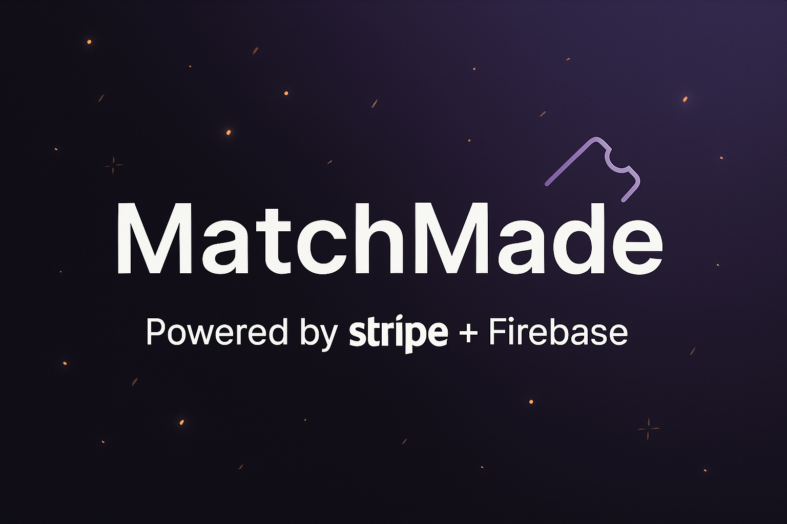

# MatchMade — Stripe × Firebase Demo

A minimal showcase integrating **Next.js (App Router)**, **Stripe Checkout**, and a **Stripe Webhook → Firebase Firestore** write.

## ✨ What we built
- **Stripe Checkout (Test Mode)** with a product price (CAD 9.90)
- **API Route** `/api/checkout` that creates a Checkout Session
- **Webhook** `/api/webhook` (Node runtime) that verifies signature and writes to **Firestore** (`payments` collection)
- **Idempotency** on webhook (prevents duplicate documents)
- **Health & Admin** helpers (`/api/health`, `/api/admin-test`)

## 🧱 Tech Stack
- Next.js 14+ (App Router, TypeScript)
- Stripe SDK (client + server)
- Firebase Admin SDK (Firestore)
- pnpm

## 🚀 Quick Start
```bash
pnpm install
pnpm dev
# open http://localhost:3000
```

## 🔑 Environment
Create `.env.local` with the following (single entries, no duplicates):

```bash
# Firebase (client)
NEXT_PUBLIC_FIREBASE_API_KEY=...
NEXT_PUBLIC_FIREBASE_AUTH_DOMAIN=...
NEXT_PUBLIC_FIREBASE_PROJECT_ID=...
NEXT_PUBLIC_FIREBASE_STORAGE_BUCKET=...
NEXT_PUBLIC_FIREBASE_MESSAGING_SENDER_ID=...
NEXT_PUBLIC_FIREBASE_APP_ID=...
NEXT_PUBLIC_FIREBASE_MEASUREMENT_ID=...

# Stripe (client+server)
NEXT_PUBLIC_STRIPE_PUBLISHABLE_KEY=pk_test_...
NEXT_PUBLIC_STRIPE_PRICE_ID=price_...
STRIPE_SECRET_KEY=sk_test_...

# Stripe Webhook
STRIPE_WEBHOOK_SECRET=whsec_...

# Firebase Admin (choose ONE)
# Prefer base64 (Windows friendly):
FIREBASE_SERVICE_ACCOUNT_BASE64=eyJ0eXBlIjoi...==
# OR plain JSON string (no base64):
# FIREBASE_SERVICE_ACCOUNT_KEY={"type":"service_account", ...}
```

## 💳 Checkout API
`/src/app/api/checkout/route.ts`
```ts
const session = await stripe.checkout.sessions.create({
  mode: "payment",
  payment_method_types: ["card"],
  line_items: [{ price: process.env.NEXT_PUBLIC_STRIPE_PRICE_ID!, quantity: 1 }],
  success_url: `${origin}/success?session_id={CHECKOUT_SESSION_ID}`,
  cancel_url: `${origin}/cancel`,
});
```

## 🔔 Webhook (payments write)
`/src/app/api/webhook/route.ts`
```ts
export const runtime = "nodejs";
export const dynamic = "force-dynamic";

const event = stripe.webhooks.constructEvent(body, sig, process.env.STRIPE_WEBHOOK_SECRET!);

if (event.type === "checkout.session.completed") {
  const session = event.data.object as Stripe.Checkout.Session;
  const ref = db.collection("payments").doc(session.id);
  const snap = await ref.get();
  if (!snap.exists) {
    await ref.set({
      status: session.status,
      mode: session.mode,
      amount_total: session.amount_total,
      currency: session.currency,
      customer_email: session.customer_details?.email ?? null,
      payment_status: session.payment_status,
      created_at: admin.firestore.FieldValue.serverTimestamp(),
    });
  }
}
```

## 🧪 Local Webhook (Stripe CLI)
```bash
# 1) Login
stripe login

# 2) Forward events locally
stripe listen --forward-to http://localhost:3000/api/webhook
# copy whsec_... into STRIPE_WEBHOOK_SECRET

# 3) Trigger a test event
stripe trigger checkout.session.completed
```

## 🗄️ Firestore
- Open Firebase Console → Firestore Database
- First enable Firestore (“Create database”)
- Webhook will create a `payments` collection automatically on first write

## 📸 Banner


---

**Author:** Orçun (github.com/OrcnTester)  
**LinkedIn:** Yörük (linkedin.com/in/orcun-yoruk-355b52147)
